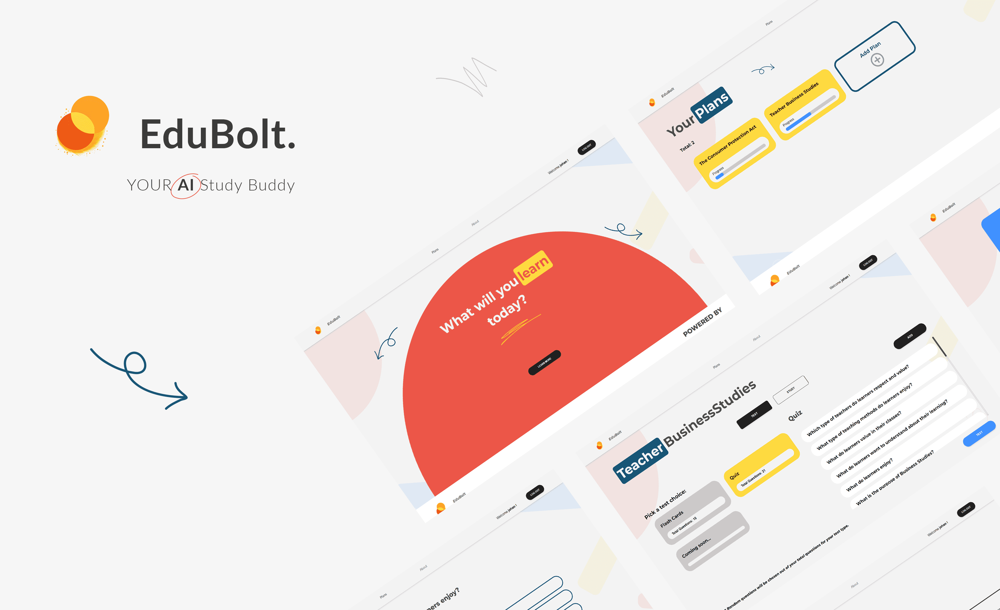

<h1 align="left">Hey, I'm Reinhardt de Beer 👋</h1>

###

###

###

<h2 align="left">About Me</h2>

###

I'm Reinhardt de Beer, a creative and passionate Mobile and Web Developer from South Africa. Welcome to my GitHub repository, where I love to explore, learn, and collaborate on exciting projects

###

<h3>What I Play Around With</h3>

  
  
  
  
  
  
  
  
  
  
  
  

###

<h3>My Skills</h3>

  
  
  
  
  
  
  
  
  
  
  
  

###

<h2>📱 Contact Me!</h2>

###

- reinardt.de.beer@gmail.com

- 0605038776

###

###

<h1 align="left">Featured Projects 👨🏻‍💻</h1>

###

<h2 align="left">Recipe Rumble</h2>

###

A cross-platform application developed with React Native and Expo. Providing a platform for not only sharing but also competing. As part of my journey in mobile app development, I created a competitive platform for Android and iOS users. Recipe Rumble allows users to sign up, dive into competitions, submit and vote on recipes, and see their results.

  

###

<h4>Features</h4>

- Login & Register
- Create and View other Competitions
- Description, Required Ingredients, Rules, Banner Image for Competition Pages
- Competition Progress bar
- Subnit entries
- Vote Entries
- View Competition results
- Double tap to vote
- Previous Submissions Saved

<a href="https://github.com/epicYellow/RecipeRumble-Improved">Link to project</a>

##

<h2 align="left">Innovex Bank</h2>

###

AWithin a group of 3, we set out to build a .Net Maui Bank Management system called Innovex Bank. Providing bank Employees with ways to administer their platform. Providing user roles (admins, staff), login, and management for the different roles and clients. Managing client accounts, and the ability to view all transaction fees, interest rates and close off each month.
Based on the brief we distributed the pages evenly, thus I set out to tackle Account Management, Client Management, as well as Staff Management later in the development process.

  

###

<h4>Features I Provided</h4>

- Add, Edit, Delete Clients, Accounts, and Staff
- Withdrawl, Deposit and Transfer between accounts

<a href="https://github.com/epicYellow/Innovex-Bank">Link to project</a>

##

<h2 align="left">Edubolt Ai</h2>

###

<a href="https://edubolt-ai-app.vercel.app/login">Deployment Link</a>

The research of a social problem and solving said problem with AI. During my high school years, I often found myself struggling to keep up with the pace of my classes. Teachers typically employed a single study method, catering to the learning styles of the fastest students, leaving many behind. This experience, coupled with research indicating widespread student uncertainty about effective study strategies and the pressure to succeed in college, prompted me to develop EduBolt, an AI study buddy.

  

###

<h4>Features</h4>

- Login with authentication and Validation
- Register with authentication and Validation
- Add Plan and add plan Content
- Store Plan Context for AI (VectorStore)
- Generate Quiz Questions with answers and options
- Generate Flash Questions with answers and options
- Generate Content Summary with Keywords Based on the provided Timeline
- Ai feedback on Quiz Results
- Ai feedback on Flash Results
- Results are stored

<a href="https://github.com/epicYellow/Edubolt-Ai">Link to project</a>

##

<h2>Personal Endeavours</h2>

 I love blending creativity with my development skills. I enjoy crafting visually appealing and highly functional applications that leave a lasting impression by fusing blender and photography into my work. For example, in my Project called RecipeRumble I created the loading indicator with Blender, the possibilities for user feedback are endless. Keep improving the process I recently discovered I can export in SVG's from Blender, which I can use to animate with CSS rather than to create a gif.

###

  

  

###
