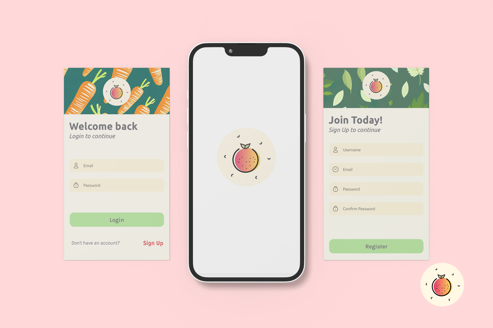

<h1 align="left">Hey, I'm Reinhardt de Beer 👋</h1>

###

###

###

<h2 align="left">About Me</h2>

###

I'm Reinhardt de Beer, a creative and passionate Mobile and Web Developer from South Africa. Welcome to my GitHub repository, where I love to explore, learn, and collaborate on exciting projects

###

<h3>My Knowledge</h3>

  
  
  
  
  
  
  
  
  
  
  
  
  
  
  
  

###

<h3>My Skills</h3>

  
  
  
  
  
  
  
  
  
  
  

###

<h2>📱 Contact Me!</h2>

###

###

<h2 align="left">My Coding Habits 👨🏻‍💻</h2>

###

###

<h2 align="left">Featured Projects 👨🏻‍💻</h2>

###

<h2 align="left">RecipeRumble Term - 2</h2>

###

Recipe Rumble is an application built entirely in JavaScript using React Native Expo. It serves as a platform where users can engage in posting, voting, and exploring various recipes and food-related competitions. With the ability to sign up and log in, users can personalize their experience by updating their profile images. The app ensures that all recipes are archived even after events have concluded, allowing users to revisit them at any time. Additionally, Recipe Rumble makes way to the discovery of new recipes and provides users with the option to share their own recipe creations.

<a href="https://github.com/epicYellow/RecipeRumble-Improved">Link to project</a>

  

