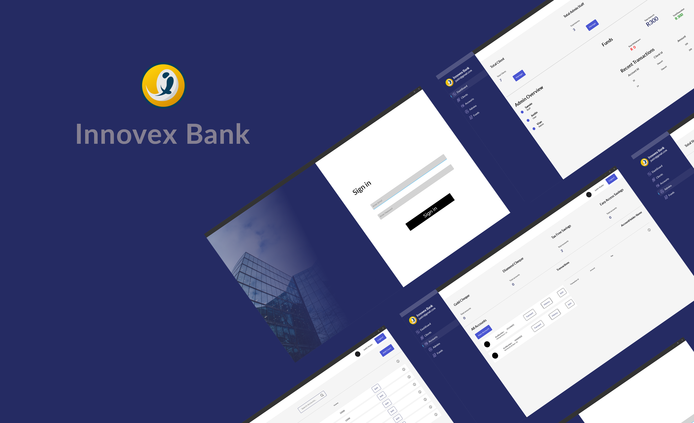
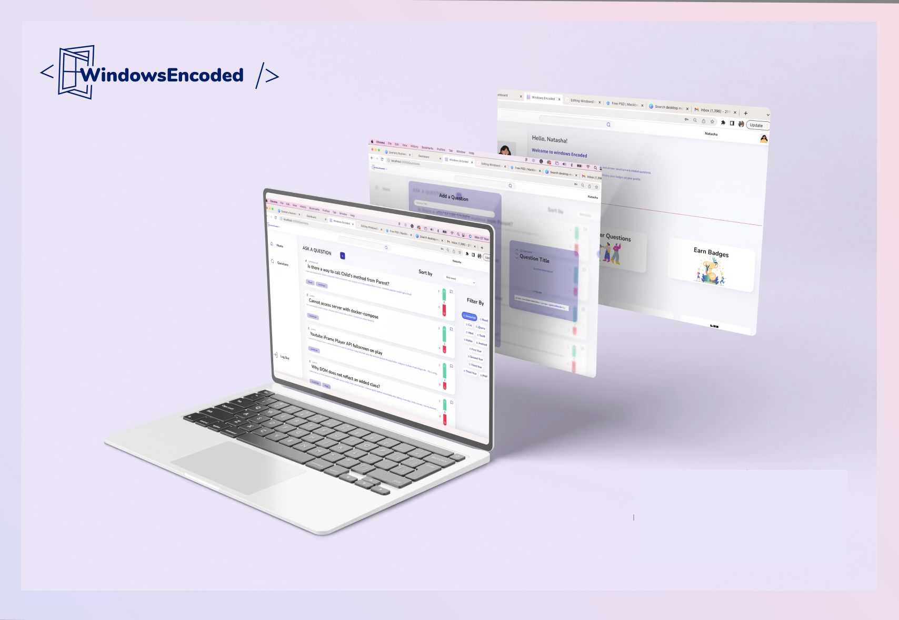
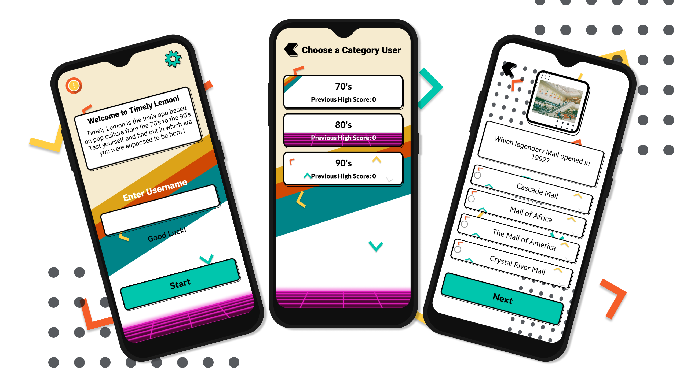

<h1 align="left">Hey, I'm Reinhardt de Beer 👋</h1>

###

###

###

<h2 align="left">About Me</h2>

###

I'm Reinhardt de Beer, a creative and passionate Mobile and Web Developer from South Africa. Welcome to my GitHub repository, where I love to explore, learn, and collaborate on exciting projects

###

<h3>My Knowledge</h3>

  
  
  
  
  
  
  
  
  
  
  
  
  
  
  
  

###

<h3>My Skills</h3>

  
  
  
  
  
  
  
  
  
  
  

###

<h2>📱 Contact Me!</h2>

###

reinardt.de.beer@gmail.com

###

<h2 align="left">My Coding Habits 👨🏻‍💻</h2>

###

###

<h1 align="left">Featured Projects 👨🏻‍💻</h1>

###

<h2 align="left">RecipeRumble</h2>

###

Recipe Rumble is an application built entirely in JavaScript using React Native Expo. It serves as a platform where users can engage in posting, voting, and exploring various recipes and food-related competitions. With the ability to sign up and log in, users can personalize their experience by updating their profile images. The app ensures that all recipes are archived even after events have concluded, allowing users to revisit them at any time. Additionally, Recipe Rumble makes way to the discovery of new recipes and provides users with the option to share their own recipe creations.

<a href="https://github.com/epicYellow/RecipeRumble-Improved">Link to project</a>

  

###

<h2 align="left">Innovex Bank</h2>

###

Innovex Bank is a robust and user-friendly bank management program developed using Maui and ASP.NET in a team of 3. This powerful tool is designed for bank administrators to streamline and simplify their daily operations.

Key Features:

Admin Management: Effortlessly manage your administrative team, assign roles, and control access.

Transaction Tracking: Keep a watchful eye on all transactions, including transaction fees, deposits, withdrawals, and transfers, ensuring transparency and security.

Client Management: Seamlessly oversee and manage client accounts, providing excellent customer service while maintaining data privacy and security.

Account and Account Type Management: Define and maintain various account types and manage accounts effectively.

Income Calculation: Automatically calculate income, making it easier to track financial performance and plan for the future.

Month-End Closure: Streamline the process of closing each month, ensuring accurate financial reporting and compliance.

<a href="https://github.com/epicYellow/Innovex-Bank.App">Link to project</a>

  

###

<h2 align="left">Windows Encoded</h2>

###

Windows Encoded is a forum for Open Window Interactive Development Students where they can ask and answer questions based on the content being taught throughout the year. Questions and answers can be upvoted and downvoted which will impact the user's reputation and overall score. Based on this score, badges can be earned leading the user one step closer to becoming an admin! This project was built using Mongo, Express, React, and Node.js.

<a href="https://github.com/epicYellow/WIndowsEncoded-React">Link to project</a>

  

###

<h2 align="left">Step By Step</h2>

###

Step By Step is a meticulously crafted application, built with Xcode IDE and SwiftUI, dedicated to helping you manage and organize a treasure trove of DIY recipes and outdoor project ideas. Our chosen theme revolves around the great outdoors, with a special focus on Patios, Fireplaces, Plants, and Wood Builds.

<a href="https://github.com/epicYellow/StepByStep-IOS">Link to project</a>

  

###

<h2 align="left">Timely Lemon</h2>

###

Timely Lemon is a trivia android app developed in Android Studio using Kotlin. This trivia app is based on pop culture from the 70's to the 90's. Based on your score you'll find out in which era you were supposed to be born.

<a href="https://github.com/epicYellow/TImelyLemon-Android">Link to project</a>

  

###

<h2>Personal Endeavours</h2>

 I love blending creativity with my development skills. I enjoy crafting visually appealing and highly functional applications that leave a lasting impression by fusing blender and photography into my work. For example, in my Project called RecipeRumble I created the loading indicator with Blender, the possibilities for user feedback are endless. Keep improving the process I recently discovered I can export in SVG's from Blender, which I can use to animate with CSS rather than to create a gif.

###

  

  

###
